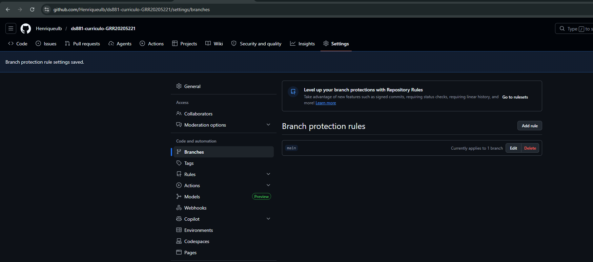
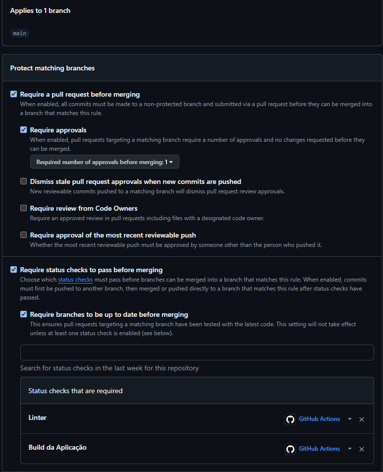

# Currículo Profissional - [Henrique Ulbrich de Souza]

🔗 **Acesse o currículo em produção:** [https://henriqueulb.github.io/ds881-curriculo-GRR20205221](https://henriqueulb.github.io/ds881-curriculo-GRR20205221)

Este projeto é um currículo profissional em formato de Single Page Application estática, desenvolvido com foco em boas práticas de DevOps, CI/CD e conteinerização.

## 🚀 Como rodar o projeto localmente (Docker)

O projeto foi inteiramente conteinerizado para facilitar o desenvolvimento. Você não precisa ter o Node.js instalado na sua máquina, apenas o Docker e o Docker Compose.

1. Clone este repositório:
```bash
   git clone [https://github.com/Henriqueulb/ds881-curriculo-GRR20205221.git](https://github.com/Henriqueulb/ds881-curriculo-GRR20205221.git)
   cd ds881-curriculo-GRR20205221
````
Imagem para regras da branch main

